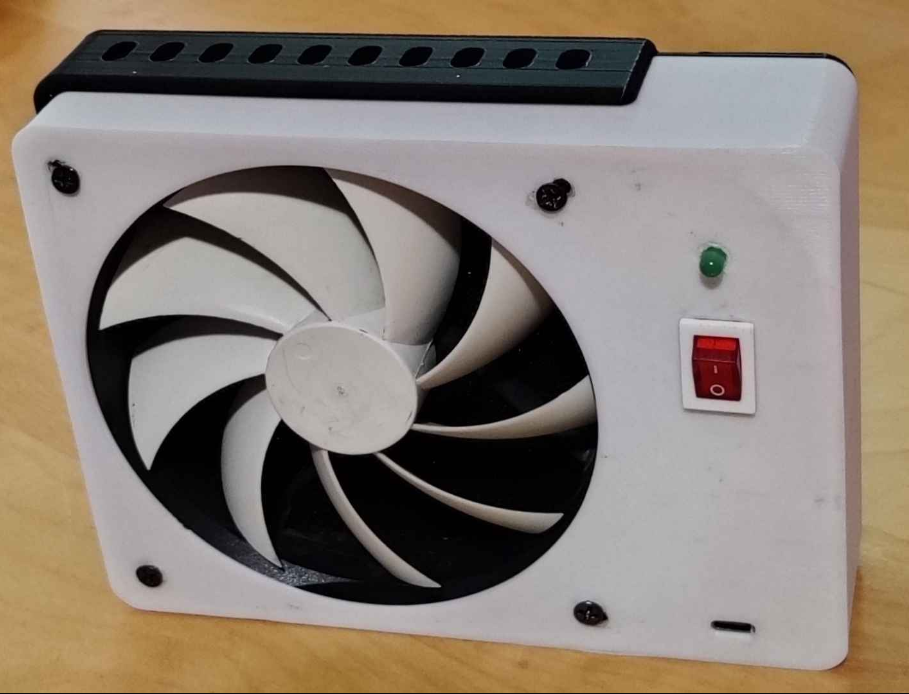
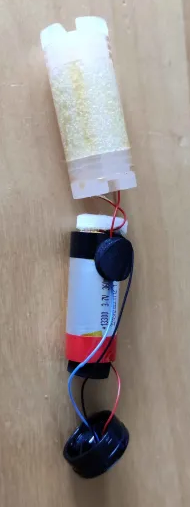
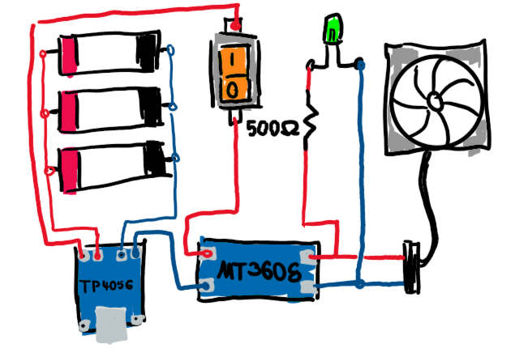
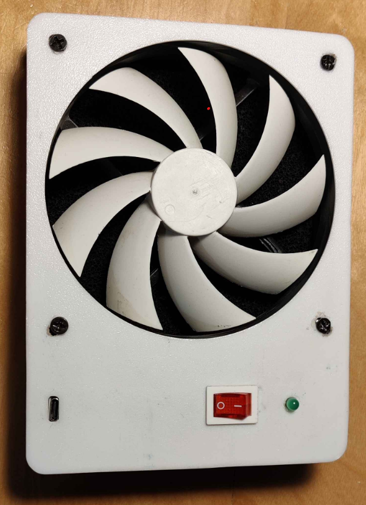
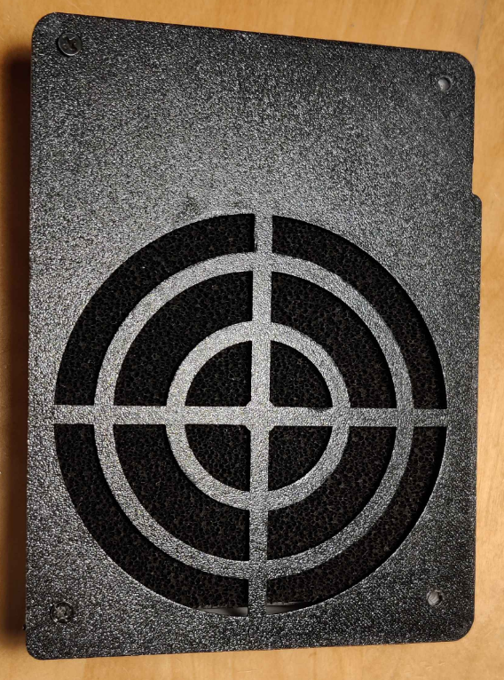

# DIY Soldering Fume Extractor Using Recycled Vape Batteries

This repository details the creation of a DIY soldering fume extractor using simple and affordable parts. This project is an excellent way to recycle old vape batteries and ensure safer soldering practices by removing harmful fumes.

## Parts:
- Standard PC fan
- MT 3608 DC-DC booster
- TP4056 board
- 3 Vape batteries
- ON/OFF switch
- LED 
- Resistor (around 500 Ohm)
- Small coal filter
- 3D Printer

## Vape Batteries:

>[!WARNING]
>Vape batteries can pose serious risks if not handled properly. Mishandling can lead to battery failure, fire, or even explosions.

<table>
  <tr>
    <td width="400">
      The usage of non-rechargeable vapes has increased significantly over the last few years. These vapes produce a lot of unnecessary waste, and the batteries inside pose a significant threat to nature or garbage trucks if not properly disposed of. Many people are unaware that even non-rechargeable vapes have rechargeable batteries inside, which can be reused for different purposes. The vapes can easily be opened with a screwdriver or by hand. After extracting the battery, the rest of the shell can be discarded with regular garbage.
        
      [!CAUTION] The inside of the vape has an extreme smell; you may want to open it outside.
    </td>
    <td>
      
    </td>
  </tr>
</table>

The batteries can be charged like normal LiPo batteries using circuit boards like the TP4056 board. It is used to charge and discharge small LiPo packs without overcharging or over-discharging them. The boards are also quite affordable, making them a good method of reusing LiPo batteries in a controlled way.

>[!NOTE]
>The batteries inside vapes can be recharged but are not designed for extensive use. They may not last as many recharge cycles as other LiPo packs, but for projects like this, where they only need to be charged occasionally, they are great.

## Circuit:
If you want to wire the components as shown, follow the sketch below:

<table>
  <tr>
    <td>
      
    </td>
    <td width="500">
      <ul>
        <li>Check the voltages of the LiPo batteries to ensure they are similar.</li>
        <li>Before making a direct parallel connection, bridge the positive terminals of the batteries with a resistor to allow for gradual voltage equalization.</li>
        <li>Once the voltages are nearly equal, remove the resistor and connect the batteries directly in parallel.</li>
        <li>Connect the output of the TP4056 board to the DC-DC booster with the switch in between.</li>
        <li>Use a multimeter to check the output voltage of the booster.</li>
        <li>Adjust the potentiometer until the voltage is at or below 12V.</li>
        <li>Connect the LED (with the resistor) and the PC fan to the 12V output.</li>
      </ul>
    </td>
  </tr>
</table>

## Casing:
The front and back parts can be downloaded from the [model folder](STL-files). Print them out and assemble the electronics inside. The USB-C input should align with the hole. Glue the TP4056 board to the casing and place the rest of the circuit inside the case, ensuring everything is insulated to avoid short circuits. Attach the fan and place the coal filter behind it. Finally, secure the back piece using regular PC case screws.

>[!TIP]
>Clean your printing bed before printing the front plate. In the images, you can see some dirt from the printing bed that has fused with the print. (The incorrect screw holes >have also been fixed now.)

 

>[!WARNING]
>This project involves handling potentially dangerous components such as LiPo batteries. Proceed with caution and at your own risk. The author is not responsible for any damage or injury resulting from the use of this guide.
